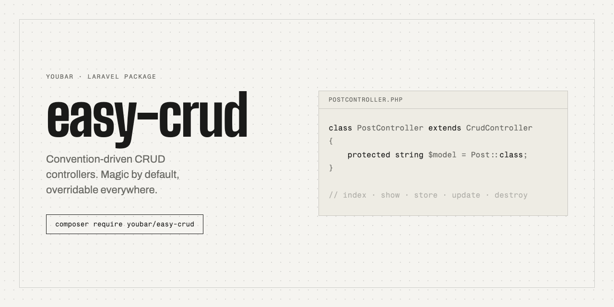

# easy-crud



[](https://github.com/Youbar/easy-crud/actions/workflows/tests.yml)
[](https://packagist.org/packages/youbar/easy-crud)
[](https://youbar.nl/docs/easy-crud)
[](LICENSE.md)

Convention-driven CRUD controllers for Laravel. Magic by default, overridable everywhere.

Most Laravel APIs contain the same controller forty times: list a model with
pagination, show one, create one, update one, delete one. `easy-crud` writes
that part once, without assuming your project is laid out like anyone else's.

```php
class PostController extends CrudController
{
    protected string $model = Post::class;
}
```

```php
Route::crud('posts', PostController::class);
```

That is a working, paginated, policy-aware JSON API.

easy-crud ships **no conventions**, so it assumes nothing about your namespaces:
out of the box it returns plain JSON and validates nothing. Tell it where your
resource and request classes live, once, and it finds them for every model from
then on.

## Installation

```bash
composer require youbar/easy-crud
```

Requires PHP 8.2+ and Laravel 12 or 13.

## The idea

One config table maps a **role** to a **pattern**, and it ships empty:

```php
'conventions' => [
    'resource' => ['App\Http\Resources\{Model}Resource'],
],
```

Ordered candidates, a `{SubNamespace}` placeholder for models grouped into
folders, a `{Domain}` one for modular layouts, or a closure when no pattern
fits.

A row only answers *which class*. The package acts on three of them —
`resource`, `collection` and `request`. Any other row resolves a class and waits
for you to read it in an override, which is how a service, action or repository
layer plugs in without the package knowing anything about it.

## Three levels

| | |
|---|---|
| **Conventions** | Declare a model. Add a pattern per role, and every model resolves from it. |
| **Method overrides** | ~15 named, typed, defaulted `protected` methods. Override what you need. |
| **Contracts** | Rebind class resolution, authorization or transformation wholesale. |

## Seeing what it decided

```bash
php artisan easy-crud:conventions Post
```

```
  Model        App\Models\Post
  Resource     App\Http\Resources\PostResource            resolved (pattern 1 of 1) ✓
  Collection   —                                           fallback: PostResource::collection()
  Request
      index    App\Http\Requests\IndexPostRequest          not found → no validation ✗
      show     App\Http\Requests\ShowPostRequest           not found → no validation ✗
      store    App\Http\Requests\StorePostRequest          resolved (pattern 1 of 2) ✓
      update   App\Http\Requests\Post\UpdateRequest        resolved (pattern 2 of 2) ✓
      destroy  App\Http\Requests\DestroyPostRequest        not found → no validation ✗
  Policy       App\Policies\PostPolicy                     view, create, update ✓
    skipped  viewAny, delete

  Custom roles (resolved only — easy-crud has no behaviour for these)
      repository App\Repositories\PostRepository           resolved (pattern 1 of 1) ✓

  Pagination   length_aware  perPage|per_page, default 15, max 100 ✓
```

## Scaffolding

```bash
php artisan make:crud-controller PostController --all
```

Generates the controller plus the resource and request classes — at the exact
paths your conventions look in, so what it writes is guaranteed to be found.

## Documentation

**[youbar.nl/docs/easy-crud](https://youbar.nl/docs/easy-crud)**

The pages live in [`docs/content`](docs/content) as plain Markdown and are
rendered by youbar.nl, which pulls this directory straight from git. Editing
docs needs no toolchain.

## Contributing

See [CONTRIBUTING.md](CONTRIBUTING.md). In short: conventional commits,
squash merges, `composer test` green.

## License

MIT. See [LICENSE.md](LICENSE.md).
